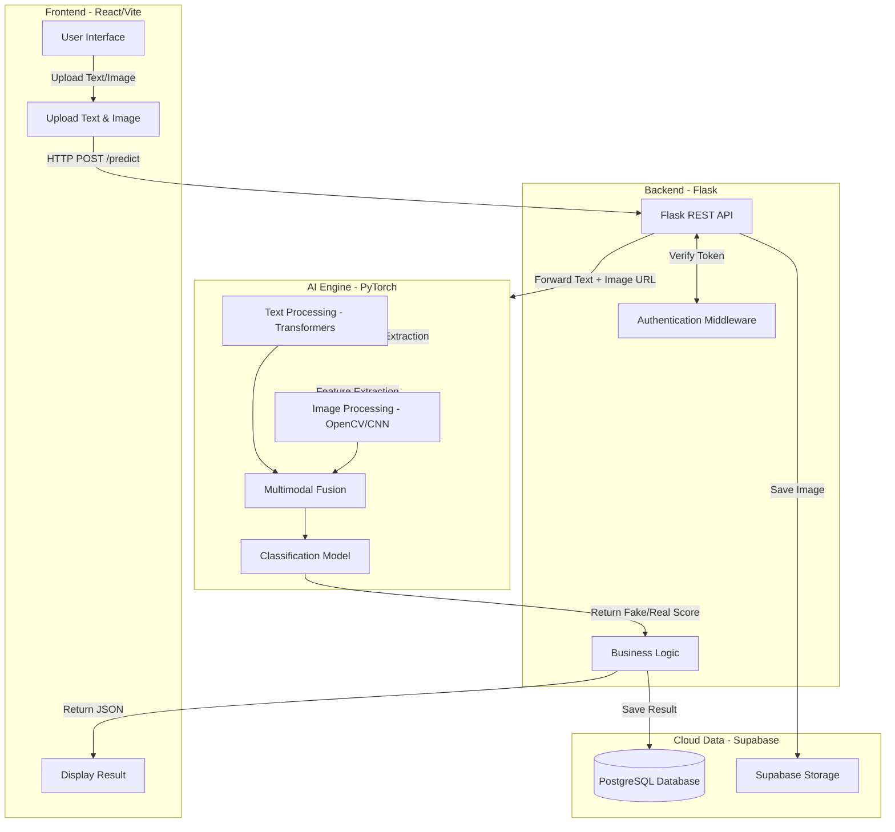

<div align="center">
  
  
  # 🕵️‍♂️ Multimodal Fake News Detection
  
  **Hệ thống phát hiện tin giả đa phương thức (Text + Image) bằng AI**

  [](https://reactjs.org/)
  [](https://flask.palletsprojects.com/)
  [](https://pytorch.org/)
  [](https://supabase.io/)
</div>

---

## 🌟 Giới thiệu Dự án

Dự án **Multimodal Fake News Detection** là một hệ thống toàn diện sử dụng trí tuệ nhân tạo để phân tích và đánh giá độ tin cậy của tin tức. Hệ thống không chỉ dựa vào nội dung văn bản (Text) mà còn phân tích cả hình ảnh đính kèm (Image) để đưa ra dự đoán chính xác hơn về việc một tin tức là **Thật (REAL)** hay **Giả (FAKE)**.

## ✨ Tính năng nổi bật

- 📝 **Phân tích Văn bản (NLP):** Áp dụng mô hình Transformer để trích xuất đặc trưng và phân tích ngữ nghĩa, giọng điệu, từ khóa bất thường.
- 🖼️ **Phân tích Hình ảnh (Computer Vision):** Sử dụng OpenCV và CNN để phát hiện các dấu hiệu chỉnh sửa, cắt ghép trong hình ảnh.
- 🔗 **Multimodal Fusion:** Kết hợp sức mạnh của cả hai mô hình (Text + Image) để cho ra một Confidence Score chính xác nhất.
- ⚡ **Giao diện Trực quan:** Ứng dụng React cung cấp trải nghiệm mượt mà, thân thiện với người dùng, kết quả được biểu diễn bằng đồ thị sinh động.
- ☁️ **Lưu trữ Cloud:** Lưu trữ lịch sử dự đoán của người dùng một cách an toàn thông qua Supabase (PostgreSQL & Storage).

---

## 🏗️ Kiến trúc Hệ thống

Hệ thống được thiết kế theo mô hình Microservices-oriented, chia làm các module độc lập.



---

## 💻 Công nghệ Sử dụng

| Frontend | Backend | AI & Model | Database & Cloud |
| :--- | :--- | :--- | :--- |
| ReactJS (Vite) | Python (Flask) | PyTorch | Supabase (PostgreSQL) |
| Tailwind CSS | RESTful API | Transformers (Hugging Face) | Supabase Storage |
| Axios | JWT Auth | OpenCV, CNN | |

---

## 📁 Cấu trúc Thư mục

```text
anti-fake-news/
├── frontend/             # Ứng dụng Web Client (React + Vite)
├── backend/              # API Server (Flask)
├── training/             # Script tiền xử lý và huấn luyện AI Model (PyTorch)
├── docs/                 # Tài liệu thiết kế hệ thống, API specs
└── README.md             # Tổng quan dự án
```

> **Lưu ý:** Xem file chi tiết `system_design.md` trong thư mục `docs/` (hoặc ở root) để biết cấu trúc file đầy đủ và luồng dữ liệu.

---

## 🚀 Cài đặt và Khởi chạy (Local Development)

### 1. Clone repository
```bash
git clone https://github.com/NguyenHoangLe0701/Multimodal-Fake-News-Detection.git
cd Multimodal-Fake-News-Detection
```

### 2. Thiết lập Backend (Flask)
```bash
cd backend
python -m venv venv
# Activate venv:
# Windows: venv\Scripts\activate
# Linux/Mac: source venv/bin/activate
pip install -r requirements.txt
python run.py
```
*(Yêu cầu thiết lập `.env` với các API key của Supabase và cấu hình model)*

### 3. Thiết lập Frontend (React)
```bash
cd frontend
npm install
npm run dev
```
Truy cập `http://localhost:5173` để trải nghiệm ứng dụng.

---

## 🛡️ License

Dự án được thực hiện cho mục đích học tập và nghiên cứu. Mọi đóng góp và ý kiến đều được hoan nghênh.
