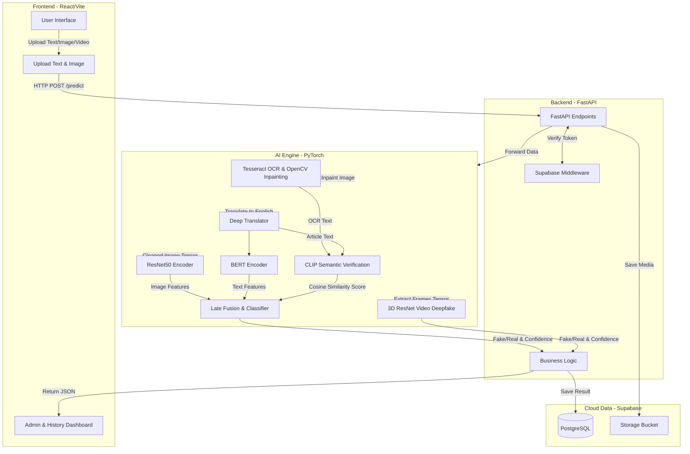

<div align="center">
  
  
  # 🕵️‍♂️ Multimodal Fake News Detection
  
  **Hệ thống phát hiện tin giả đa phương thức (Text + Image + Video) bằng AI**

  [](https://react.dev/)
  [](https://fastapi.tiangolo.com/)
  [](https://pytorch.org/)
  [](https://supabase.io/)
  [](https://tailwindcss.com/)
</div>

---

## 🌟 Giới thiệu Dự án

Dự án **Multimodal Fake News Detection** là một hệ thống toàn diện sử dụng trí tuệ nhân tạo để phân tích và đánh giá độ tin cậy của tin tức. Hệ thống không chỉ dựa vào nội dung văn bản (Text) mà còn phân tích cả hình ảnh đính kèm (Image) và video (Video Deepfake) để đưa ra dự đoán chính xác hơn về việc một phương tiện truyền thông là **Thật (REAL)** hay **Giả (FAKE)**.

Hệ thống có khả năng tự động trích xuất văn bản từ hình ảnh (OCR) và dịch ngôn ngữ tự động để phân tích dữ liệu song ngữ (Việt - Anh).

## ✨ Tính năng nổi bật

- 📝 **Phân tích Văn bản (NLP):** Áp dụng mô hình Transformer (BERT/RoBERTa) để trích xuất đặc trưng và phân tích ngữ nghĩa, giọng điệu, từ khóa bất thường.
- 🖼️ **Phân tích Hình ảnh (Computer Vision):** Sử dụng ResNet50 (CNN) để trích xuất đặc trưng hình ảnh kết hợp với bối cảnh bài viết.
- 🎬 **Phân tích Video (Deepfake Detection):** Ứng dụng mô hình mạng nơ-ron chập 3D (3D ResNet - r3d_18) để trích xuất đặc trưng theo cả không gian (spatial) và thời gian (temporal) nhằm phát hiện video bị cắt ghép, làm giả.
- 🔗 **Hệ thống Kiểm chứng Đa cổng (Gate System):** Kết hợp sức mạnh của đa luồng dữ liệu (Text + Image). Sử dụng mô hình **CLIP (ViT-B/32)** của OpenAI để đo lường độ lệch pha ngữ nghĩa (Cosine Similarity) giữa Chữ và Ảnh, phát hiện các trường hợp "Ảnh thật, Chữ thật nhưng ghép sai ngữ cảnh".
- 🔤 **Tích hợp OCR, Xóa chữ & Dịch Thuật:** Tự động nhận diện chữ trong ảnh (Tesseract OCR), làm sạch ảnh bằng OpenCV Inpainting, đối chiếu chéo văn bản (Cross-check) và dịch nội dung tiếng Việt sang tiếng Anh (Deep Translator) để đưa vào mô hình học sâu.
- ⚡ **Giao diện Trực quan & Mượt mà:** Ứng dụng React 19 với TailwindCSS v4 và Framer Motion cung cấp trải nghiệm hiện đại, thân thiện, kết quả được biểu diễn bằng đồ thị sinh động.
- ☁️ **Lưu trữ Cloud & Quản trị:** Quản lý người dùng, phân quyền Admin và lưu trữ lịch sử bằng Supabase (PostgreSQL & Storage).

---

## 📋 Yêu cầu Hệ thống (User Requirement)

Sơ đồ quy trình nghiệp vụ và luồng xử lý AI của hệ thống từ lúc nhận yêu cầu (Input) đến lúc ra kết quả (Output).


---

## 🏗️ Kiến trúc Hệ thống

Hệ thống được thiết kế theo mô hình Microservices, chia làm các module độc lập tương tác qua RESTful API.



---

## 💻 Công nghệ Sử dụng

| Frontend (Web Client) | Backend (API Server) | AI & Machine Learning | Database & Cloud |
| :--- | :--- | :--- | :--- |
| **React 19** (Vite) | **FastAPI** (Python 3.10+) | **PyTorch** | **Supabase** (PostgreSQL) |
| **Tailwind CSS v4** | Uvicorn (ASGI Server) | Transformers (BERT & CLIP) | Supabase Storage |
| Framer Motion | Pydantic | OpenCV & Pillow | Supabase Auth |
| Lucide React & Recharts | Python-Dotenv | Tesseract OCR | |

---

## 📁 Cấu trúc Thư mục

```text
Multimodal-Fake-News-Detection/
├── frontend/             # Ứng dụng Web Client (React 19 + Vite)
│   ├── src/              # Mã nguồn React (Pages, Components, Services)
│   └── package.json      # Cấu hình thư viện Frontend
├── backend/              # API Server (FastAPI)
│   ├── app/              # Logic xử lý API, Auth, Database
│   ├── model_weights/    # Chứa file weights (.pth) của mô hình AI
│   └── requirements.txt  # Cấu hình thư viện Python
├── training/             # (Tùy chọn) Script tiền xử lý và huấn luyện AI Model
├── docs/                 # Tài liệu thiết kế hệ thống, API specs
└── README.md             # Tổng quan dự án (File này)
```

---

## 🚀 Cài đặt và Khởi chạy (Local Development)

### 1. Clone repository
```bash
git clone https://github.com/NguyenHoangLe0701/Multimodal-Fake-News-Detection.git
cd Multimodal-Fake-News-Detection
```

### 2. Thiết lập Backend (FastAPI & AI)
Yêu cầu hệ thống cài đặt sẵn [Tesseract OCR](https://github.com/UB-Mannheim/tesseract/wiki). Trên Windows có thể cài qua: `winget install -e --id UB-Mannheim.TesseractOCR`

```bash
cd backend
python -m venv venv

# Activate venv:
# Windows: venv\Scripts\activate
# Linux/Mac: source venv/bin/activate

pip install -r requirements.txt
```

**Cấu hình môi trường Backend:**
Tạo file `.env` trong thư mục `backend/` và điền thông tin Supabase của bạn:
```env
SUPABASE_URL=your_supabase_url
SUPABASE_KEY=your_supabase_anon_key
```

**Khởi chạy Backend:**
```bash
python run.py
```
API sẽ chạy tại: `http://127.0.0.1:8000`

### 3. Thiết lập Frontend (React)
```bash
cd frontend
npm install
```

**Cấu hình môi trường Frontend:**
Tạo file `.env` trong thư mục `frontend/`:
```env
VITE_SUPABASE_URL=your_supabase_url
VITE_SUPABASE_ANON_KEY=your_supabase_anon_key
```

**Khởi chạy Frontend:**
```bash
npm run dev
```
Truy cập `http://localhost:5173` để trải nghiệm ứng dụng.

---

## 🛡️ License

Dự án được thực hiện cho mục đích học tập và nghiên cứu. Mọi đóng góp và ý kiến đều được hoan nghênh.
