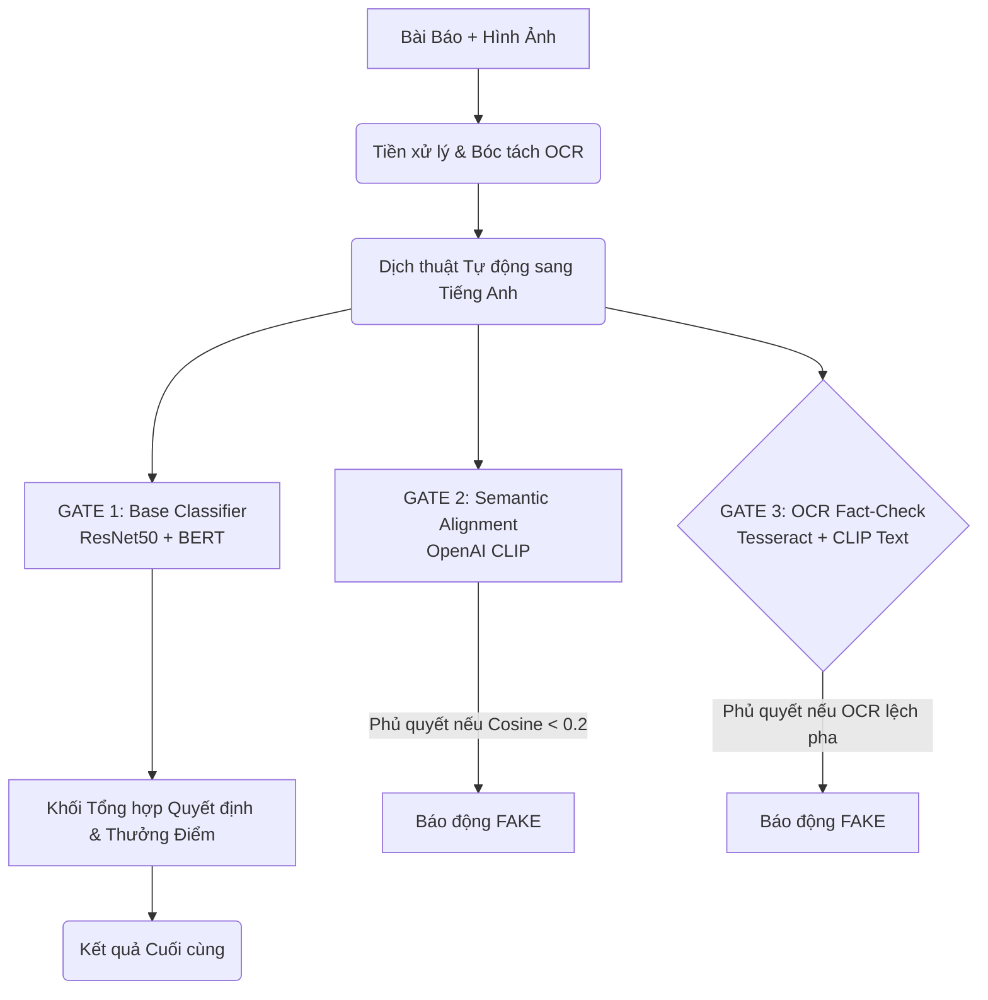

# BÁO CÁO KỸ THUẬT CHI TIẾT
## CƠ CHẾ NHẬN DIỆN TIN GIẢ ĐA PHƯƠNG THỨC (TRUTHGUARD V2)

Tài liệu này được biên soạn chuyên sâu để phục vụ cho việc làm Báo cáo/Khóa luận. Nó trình bày chi tiết luồng logic, các công nghệ được sử dụng và thuật toán bên trong từng lớp bảo vệ của hệ thống.

---

## 1. TỔNG QUAN KIẾN TRÚC HỆ THÔNG (PIPELINE)

Hệ thống xử lý tin giả đa phương thức hiện tại không hoạt động như một cỗ máy học sâu "End-to-End" hộp đen thông thường. Thay vào đó, nó được thiết kế theo kiến trúc **Bảo vệ Đa tầng (Multi-Gate Defense Pipeline)**. 

Mỗi yêu cầu phân tích (gồm 1 Bài báo và 1 Hình ảnh) sẽ đi qua 3 Cổng kiểm duyệt độc lập để chặn đứng các thủ đoạn tạo tin giả từ sơ đẳng đến tinh vi nhất.

---

## 2. PHÂN TÍCH CHI TIẾT TỪNG LỚP CƠ CHẾ

### 2.1. Tiền xử lý & Dịch thuật (Preprocessing & Translation)
Do đặc thù các mô hình trí tuệ nhân tạo mạnh nhất thế giới (như OpenAI CLIP) đều được huấn luyện trên ngữ liệu Tiếng Anh, hệ thống phải thực hiện chuyển đổi ngôn ngữ trước khi phân tích:
- **Image Inpainting:** Sử dụng OpenCV (`cv2.inpaint`) để xóa chữ mờ trên ảnh gốc (tránh nhiễu cho mô hình ResNet).
- **OCR (Optical Character Recognition):** Sử dụng Tesseract với tệp ngôn ngữ `vie.traineddata` để bóc tách đoạn chữ tiếng Việt nằm bên trong bức ảnh.
- **Deep Translation:** Sử dụng thư viện `deep-translator` dịch Bài báo và Chữ trong ảnh sang Tiếng Anh theo thời gian thực.

### 2.2. GATE 1: Lõi Phân loại Cơ sở (Late Fusion Classification)
Đây là lõi được huấn luyện (Fine-tuned) trên bộ dữ liệu tin giả thực tế.
- **Xử lý Văn bản:** Đưa qua mô hình **BERT** để trích xuất vector ngữ nghĩa 768 chiều. Nó giúp nhận diện văn phong giật tít, ngôn từ kích động hoặc cấu trúc câu phi logic.
- **Xử lý Hình ảnh:** Đưa qua mô hình **ResNet50** để trích xuất vector đặc trưng 2048 chiều. Nó giúp soi các vùng ảnh bị nhiễu do can thiệp công cụ chỉnh sửa hoặc cắt ghép.
- **Thuật toán:** Hai vector được nối lại (Concatenation) thành vector 2816 chiều, đi qua các lớp Fully Connected Layers và hàm `Softmax` để trả về xác suất ban đầu (`prob_real` và `prob_fake`).

### 2.3. GATE 2: Đối chiếu Ngữ nghĩa Chéo (Semantic Alignment Check)
Khắc phục lỗ hổng: *"Bài báo thật, Hình ảnh thật, nhưng bị kẻ gian gán ghép sai chủ đề (Ví dụ: Ảnh con mèo gắn vào bài báo giá xăng)"*.
- **Công nghệ:** OpenAI CLIP (ViT-B/32).
- **Thuật toán:** Đưa hình ảnh và văn bản vào chung một không gian vector đa chiều (Joint Embedding Space). Tính toán độ tương đồng **Cosine Similarity**.
- **Cơ chế Phủ quyết:** Nếu điểm Cosine `< 0.2` (ngưỡng bất đồng thuận), Gate 2 sẽ đóng cửa, gạt bỏ hoàn toàn điểm số của Gate 1 và ép kết quả thành **FAKE**.
- **Tính điểm độ tin cậy ép (Clamped Confidence):** Dựa trên độ lệch pha, độ tự tin được tính bằng công thức: `confidence = min(0.9999, 1.0 - cos_sim_val)`. Càng lệch pha, điểm FAKE càng tiệm cận 100%.

### 2.4. GATE 3: Kiểm chứng Sự thật qua Chữ viết (OCR Fact-Checking)
Khắc phục lỗ hổng: *"Treo đầu dê bán thịt chó (Ảnh một sự kiện chính trị thật, nhưng nội dung trên băng rôn trong ảnh bị sai lệch với bài báo)"*.
- **Điều kiện kích hoạt:** Bức ảnh phải chứa một đoạn chữ rõ ràng dài hơn 15 ký tự và tỷ lệ chữ cái > 50%.
- **Thuật toán:** 
  - Lấy bản dịch tiếng Anh của chữ trong ảnh (OCR English) và bản dịch của bài báo.
  - Sử dụng Bộ mã hóa Văn bản (Text-Encoder) của mô hình CLIP để tính **Text-to-Text Cosine Similarity**.
- **Cơ chế Phủ quyết:** Do đặc thù vector không gian văn bản của CLIP rất hội tụ, ngưỡng chặn được nâng lên mức rất khắt khe là `0.82`. Nếu `ocr_cos_sim < 0.82`, hệ thống lập tức báo **FAKE** vì nội dung trong bức ảnh hoàn toàn mâu thuẫn với bài báo.

### 2.5. Cơ chế Thưởng điểm (Confidence Reward Mechanism)
Giải quyết bài toán: *"Mô hình AI cơ sở thường rất thiếu tự tin khi đánh giá tin thật (điểm thường lẹt đẹt ở mức 50-60%)"*.
- **Thuật toán:** Nếu Bài báo vượt qua cả 3 Ải bảo vệ (được công nhận là REAL), hệ thống sẽ xét thêm độ ăn khớp tổng thể. Nếu `cos_sim > 0.25` (Khớp ngữ cảnh hoàn hảo), mô hình sẽ được "thưởng" thêm một mức điểm tự tin.
- **Công thức tính thưởng:** `confidence = min(0.99, confidence + (cos_sim_val - 0.20) * 1.5)`. 
- **Kết quả:** Những bài báo chính thống có hình ảnh minh họa chân thực sẽ đạt mức điểm tự tin (Confidence) trên 85% - 95%, nâng cao độ tin cậy và trải nghiệm của người dùng.

---

## 3. TỔNG KẾT
Sự kết hợp giữa Mô hình Học Sâu Cổ điển (ResNet + BERT) và Mô hình Ngôn ngữ - Thị giác Hiện đại (OpenAI CLIP + Tesseract OCR) đã tạo ra một lớp giáp mạng nhện vững chắc. Các mô hình bọc lót điểm mù cho nhau, giúp hệ thống không chỉ phát hiện được tin giả bằng thuật toán, mà còn có khả năng "đối chiếu tư duy logic" không kém gì một biên tập viên con người.
