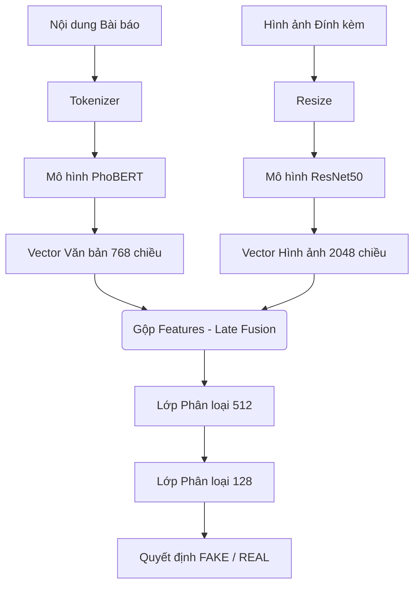

# Tổng quan Kiến trúc AntiFakeNews: Crawler & AI Model

Tài liệu này giải thích chi tiết cấu trúc hệ thống thu thập dữ liệu (Crawler) và bộ khung Trí tuệ Nhân tạo đa phương thức (Multimodal AI) vừa được thiết lập trong dự án.

## 1. Hệ thống Thu thập Dữ liệu (Crawler)

> [!TIP]
> Việc tự tạo Crawler giúp bạn kiểm soát được chất lượng dữ liệu, có nguồn data "sạch" và sát với tình hình tin giả hiện tại ở Việt Nam.

**Kiến trúc:**
- Script `vnexpress_crawler.py` sử dụng thư viện `BeautifulSoup4` để truy cập và bóc tách cấu trúc HTML.
- Thu thập đồng thời: `Tiêu đề`, `Nội dung`, và `Link Hình ảnh`.
- Script `prepare_train_data.py` tự động tải các file hình ảnh về thư mục `datasets/images/`, đổi tên bằng UUID để tránh trùng lặp.
- Dữ liệu được nối lại và gán nhãn `label = 0` (REAL) để tạo ra file `train.csv` siêu sạch.

## 2. Kiến trúc AI Đa phương thức (Multimodal)

Dự án sử dụng cơ chế **Late Fusion (Kết hợp trễ)** để AI có thể "nhìn" hình ảnh và "đọc" văn bản cùng một lúc trước khi đưa ra quyết định FAKE hay REAL.

### 2.1. Nhánh Văn bản (Text Branch)
- **Công nghệ:** HuggingFace `AutoModel`
- **Mô hình:** `vinai/phobert-base`.
- **Lý do:** PhoBERT được train riêng cho Tiếng Việt với 135 GB dữ liệu, hiểu được cả các từ ghép, từ lóng của Việt Nam tốt gấp nhiều lần so với mô hình BERT tiếng Anh thông thường.

### 2.2. Nhánh Hình ảnh (Image Branch)
- **Công nghệ:** `torchvision.models`
- **Mô hình:** `ResNet50`.
- **Cách thức:** Mô hình sẽ tự động crop ảnh về kích thước `224x224`, chuẩn hóa màu sắc và đẩy qua mạng nơ-ron chập (CNN) cực sâu để chiết xuất các đặc trưng đồ họa (dấu hiệu ảnh bị cắt ghép, làm mờ...). Lớp Softmax cuối cùng được gỡ bỏ để lấy vector `2048` chiều thuần túy.

### 2.3. Hợp nhất & Huấn luyện (Fusion & Training)
- Hai vector văn bản và hình ảnh được gộp (`concatenate`) thành một khối `2816` chiều.
- Dữ liệu này đi qua các lớp Fully Connected (`Linear`, `ReLU`, `Dropout`) để tìm ra sự bất đồng nhất. Ví dụ: *Văn bản viết về bão lũ ở Hà Nội nhưng hình ảnh lại là tuyết rơi*.
- Loss Function: `CrossEntropyLoss`.
- Optimizer: `AdamW` với Learning Rate siêu nhỏ `2e-5` (tránh phá hỏng tệp trọng số có sẵn của PhoBERT).

## 3. Database & Authentication (Phase 3)

> [!IMPORTANT]
> Dự án sử dụng Backend **Flask** kết nối với **Supabase** (thay thế cho Firebase/PostgreSQL truyền thống) giúp hệ thống nhẹ và bảo mật hơn rất nhiều.

- `auth.py`: Đã thiết lập hoàn thiện luồng **Register** và **Login**. 
- Các logic này gọi trực tiếp đến `client.auth` của Supabase trong file `supabase_service.py` để xử lý mã hóa JWT Token theo tiêu chuẩn bảo mật quốc tế.
- Tất cả lịch sử quét của người dùng sẽ được lưu trữ an toàn trong bảng `predictions`.
