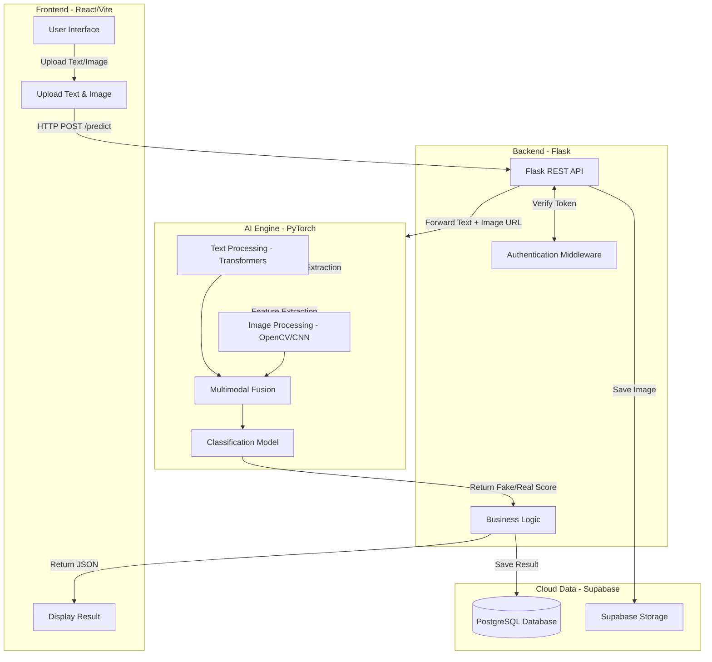

# System Design: Anti Fake News Detection Using Multimodal Learning

## 1. System Architecture

Dự án sử dụng kiến trúc Client-Server kết hợp với Cloud Database và AI Service độc lập.



### Luồng xử lý chi tiết (Data Flow)
1. **User Upload Image + News Content:** Người dùng nhập tiêu đề/nội dung tin tức và tải lên một hình ảnh minh họa qua giao diện React.
2. **React:** Đóng gói dữ liệu thành FormData và gọi API `/api/predict` của Flask Backend thông qua Axios.
3. **Flask API:** Tiếp nhận Request. Upload hình ảnh tạm thời lên Supabase Storage lấy Public URL.
4. **AI Model:** Flask gọi module AI (đã load sẵn model vào memory để tối ưu) truyền vào Text và Image URL (hoặc trực tiếp qua buffer). Text được xử lý qua Transformer, Image qua OpenCV/CNN. Kết hợp lại qua Multimodal Fusion để đưa ra kết quả.
5. **Prediction:** Trả về kết quả phân loại (Fake/Real) kèm theo độ tin cậy (Confidence Score).
6. **Supabase:** Flask lưu trữ thông tin User, Text, Image URL và Kết quả Prediction vào Database Supabase PostgreSQL.
7. **Return Result:** Flask trả về Response JSON cho React hiển thị kết quả cho người dùng.

---

## 2. Folder Tree

Cấu trúc thư mục được chia thành các dịch vụ độc lập giúp dễ quản lý và dễ triển khai (Microservices-oriented).

```text
anti-fake-news/
├── frontend/             # Ứng dụng Web Client
├── backend/              # API Server
├── training/             # Xây dựng và Huấn luyện AI Model
├── docs/                 # Tài liệu dự án
├── .gitignore
└── README.md
```

---

## 3. File Structure & Function Explanation

### 3.1. Thư mục `frontend/` (React + Vite)
Chứa toàn bộ mã nguồn của giao diện người dùng.

* **Chức năng:** Nhận tương tác từ người dùng, gọi API và hiển thị dữ liệu.
* **Cấu trúc:**
  ```text
  frontend/
  ├── public/                 # Tài nguyên tĩnh (favicon, logo)
  ├── src/
  │   ├── assets/             # Hình ảnh, icon nội bộ
  │   ├── components/         # Các UI component dùng chung
  │   │   ├── Navbar.jsx      # Thanh điều hướng
  │   │   ├── Footer.jsx      # Chân trang
  │   │   ├── UploadBox.jsx   # Khung kéo thả upload ảnh
  │   │   └── ResultCard.jsx  # Thẻ hiển thị kết quả
  │   ├── pages/              # Các trang chính của ứng dụng
  │   │   ├── Home.jsx        # Trang chủ giới thiệu
  │   │   ├── Detect.jsx      # Trang thực hiện kiểm tra tin giả
  │   │   ├── History.jsx     # Trang lịch sử kiểm tra
  │   │   └── About.jsx       # Trang giới thiệu dự án & nhóm
  │   ├── services/           # Các hàm gọi API (Axios)
  │   │   ├── api.js          # Cấu hình Axios instance
  │   │   └── detection.js    # Các hàm gọi API liên quan detect
  │   ├── utils/              # Các hàm tiện ích (format date, validation)
  │   ├── App.jsx             # Component gốc, cấu hình React Router
  │   ├── main.jsx            # Điểm entry của React
  │   └── index.css           # File CSS toàn cục (cấu hình Tailwind)
  ├── package.json
  ├── tailwind.config.js      # Cấu hình Tailwind CSS
  └── vite.config.js          # Cấu hình Vite
  ```

### 3.2. Thư mục `backend/` (Flask)
Chứa mã nguồn API Server xử lý logic và giao tiếp Model & DB.

* **Chức năng:** Cung cấp RESTful APIs, kết nối DB, và tích hợp AI logic.
* **Cấu trúc:**
  ```text
  backend/
  ├── app/                    # Mã nguồn chính của ứng dụng
  │   ├── __init__.py         # Khởi tạo Flask App, cấu hình CORS, Blueprint
  │   ├── routes/             # Định nghĩa các Endpoints (Controllers)
  │   │   ├── auth.py         # API Đăng nhập/Đăng ký
  │   │   ├── predict.py      # API Nhận diện tin giả
  │   │   └── history.py      # API Lấy lịch sử
  │   ├── services/           # Chứa Business Logic (tách biệt khỏi routes)
  │   │   ├── ai_service.py   # Gọi/Infer model AI
  │   │   └── db_service.py   # Giao tiếp với Supabase DB & Storage
  │   ├── models/             # Định nghĩa Data Schema (Pydantic/Marshmallow nếu cần)
  │   ├── utils/              # Tiện ích (xử lý file, handle error)
  │   └── ai_core/            # Nơi chứa các file weight (.pth) và script chạy inference model
  │       ├── model.py        # Kiến trúc class Pytorch model
  │       └── weights/        # Folder chứa file model weight
  ├── tests/                  # Unit tests cho backend
  ├── .env                    # Biến môi trường (DB URI, API Keys)
  ├── requirements.txt        # Danh sách thư viện Python
  └── run.py                  # File khởi chạy Flask Server
  ```

### 3.3. Thư mục `training/` (AI & Machine Learning)
Chứa các script dùng cho R&D, huấn luyện và đánh giá model. Không dùng cho production server.

* **Chức năng:** Tiền xử lý dữ liệu, huấn luyện mô hình đa phương thức, xuất ra file weights.
* **Cấu trúc:**
  ```text
  training/
  ├── data/                   # Thư mục chứa dataset gốc và đã xử lý
  │   ├── raw/
  │   └── processed/
  ├── notebooks/              # Jupyter Notebooks cho EDA, thử nghiệm nhanh
  │   ├── 01_EDA.ipynb
  │   └── 02_Model_Experiment.ipynb
  ├── src/                    # Mã nguồn training chuẩn hóa
  │   ├── dataset.py          # Class Pytorch Dataset
  │   ├── models/             # Định nghĩa kiến trúc (Text, Image, Fusion)
  │   ├── train.py            # Script chạy training loop
  │   └── evaluate.py         # Script tính toán metrics (F1, Accuracy)
  └── requirements.txt        # Môi trường cho training (thường nặng hơn backend)
  ```

### 3.4. Thư mục `docs/` (Tài liệu)
* **Chức năng:** Lưu trữ thiết kế, báo cáo, API specs.
* **Cấu trúc:**
  ```text
  docs/
  ├── architecture.md         # Mô tả kiến trúc hệ thống
  ├── api_specs.yaml          # Tài liệu API (Swagger/OpenAPI format)
  ├── database_schema.md      # Thiết kế CSDL
  └── report/                 # Báo cáo Word/PDF cuối kỳ
  ```

---

## 4. UI Design (Thiết kế Giao diện React)

### 4.1. Home Page (`/`)
* **Mục đích:** Landing page giới thiệu trực quan về ứng dụng.
* **Thành phần UI:**
  * **Hero Section:** Tiêu đề lớn (Headline), Mô tả ngắn gọn, Nút Call-to-Action (CTA) "Start Detection Now". Ảnh minh họa hoặc animation 3D nhẹ.
  * **Features Section:** 3 cột giới thiệu tính năng: Phân tích Văn bản (NLP), Phân tích Hình ảnh (Computer Vision), Kết quả đa phương thức (Multimodal).
* **Luồng:** Nhấn nút CTA -> chuyển hướng sang trang `Detect.jsx`.

### 4.2. Fake News Detection Page (`/detect`)
* **Mục đích:** Trang cốt lõi để người dùng nhập thông tin và nhận kết quả.
* **Thành phần UI:**
  * **Left Panel (Input):**
    * Textarea cho nội dung tin tức.
    * Drag & Drop zone để tải ảnh (sử dụng component `UploadBox.jsx`).
    * Nút "Analyze" (hiệu ứng Loading spinner khi gọi API).
  * **Right Panel (Output - Ẩn lúc đầu):**
    * Component `ResultCard.jsx` hiển thị kết quả:
      * Nhãn (Label): **REAL** (Xanh lá) / **FAKE** (Đỏ).
      * Gauge Chart (Biểu đồ vòng cung) biểu thị Confidence Score (ví dụ: 85% Fake).
      * Phân tích chi tiết: Điểm bất thường trong ảnh (nếu có), Cảnh báo từ khóa trong văn bản.

### 4.3. History Page (`/history`)
* **Mục đích:** Liệt kê các tin tức người dùng đã từng kiểm tra.
* **Thành phần UI:**
  * Data Table hoặc Grid List hiển thị danh sách dạng Card.
  * Mỗi item gồm: Thumbnail ảnh, trích đoạn text, Kết quả, Ngày giờ kiểm tra.
  * Nút xem lại chi tiết.
  * (Yêu cầu User đăng nhập mới xem được).

### 4.4. About Project Page (`/about`)
* **Mục đích:** Trang thông tin đồ án.
* **Thành phần UI:**
  * Giới thiệu công nghệ (Tech stack logos).
  * Thông tin giảng viên hướng dẫn.
  * Profile thành viên nhóm (Avatar, Tên, Vai trò).

---

## 5. Database Design (Supabase PostgreSQL)

Thiết kế đơn giản tập trung vào lưu trữ lịch sử người dùng.

### Bảng `users` (Supabase Auth cấp sẵn hoặc tạo bảng extend)
* `id` (UUID, PK)
* `email` (String, Unique)
* `full_name` (String)
* `created_at` (Timestamp)

### Bảng `predictions` (Lịch sử dự đoán)
* `id` (UUID, PK)
* `user_id` (UUID, FK -> `users.id`, nullable cho guest)
* `news_text` (Text) - Nội dung user nhập
* `image_url` (String) - URL trỏ tới Supabase Storage
* `prediction_label` (String) - 'FAKE' hoặc 'REAL'
* `confidence_score` (Float) - 0.0 đến 1.0
* `created_at` (Timestamp)

---

## 6. Development Roadmap & GitHub Workflow

### 6.1. Đề xuất cấu trúc Nhánh (Git Branching)
Dự án áp dụng mô hình Git Flow rút gọn:
* `main`: Nhánh chứa code Production hoàn chỉnh, ổn định. Chỉ merge từ `develop`.
* `develop`: Nhánh Integration chung. Nơi hợp nhất các features trước khi ra release.
* `feature/frontend-*`: Các nhánh làm UI/React (VD: `feature/frontend-detect-page`).
* `feature/backend-*`: Các nhánh làm API/Flask (VD: `feature/backend-predict-api`).
* `feature/ai-*`: Các nhánh huấn luyện/tích hợp model (VD: `feature/ai-multimodal-fusion`).

### 6.2. Commit Convention (Quy tắc Commit)
Sử dụng **Conventional Commits**:
* `feat:` Thêm tính năng mới (VD: `feat: add result card component`).
* `fix:` Sửa lỗi (VD: `fix: resolve CORS issue on API`).
* `refactor:` Viết lại code nhưng không đổi logic (VD: `refactor: move db logic to services`).
* `docs:` Sửa tài liệu (VD: `docs: update setup instruction in README`).
* `test:` Thêm/sửa unit tests (VD: `test: add tests for auth route`).

### 6.3. Lộ trình phát triển (Roadmap)
* **Giai đoạn 1: Foundation (Tuần 1)**
  * Khởi tạo repo, setup folder structure.
  * Tạo DB Supabase, setup dự án React và Flask cơ bản.
* **Giai đoạn 2: AI & Data (Tuần 2-4)**
  * Thu thập/Tiền xử lý dữ liệu tin giả đa phương thức.
  * Xây dựng và huấn luyện mô hình PyTorch trong thư mục `training/`.
  * Đóng gói mô hình thành weight `.pth`.
* **Giai đoạn 3: Backend Integration (Tuần 5)**
  * Load model vào Flask `ai_core`.
  * Viết API `/predict` và kết nối Supabase.
* **Giai đoạn 4: Frontend Development (Tuần 6-7)**
  * Code UI cho các trang Home, Detect, History.
  * Tích hợp Axios gọi API Backend.
* **Giai đoạn 5: Testing & Deployment (Tuần 8)**
  * Fix bugs, đánh giá hiệu năng mô hình.
  * Deploy Frontend lên Vercel/Netlify.
  * Deploy Backend lên Render/Railway.
  * Viết báo cáo `docs/`.
